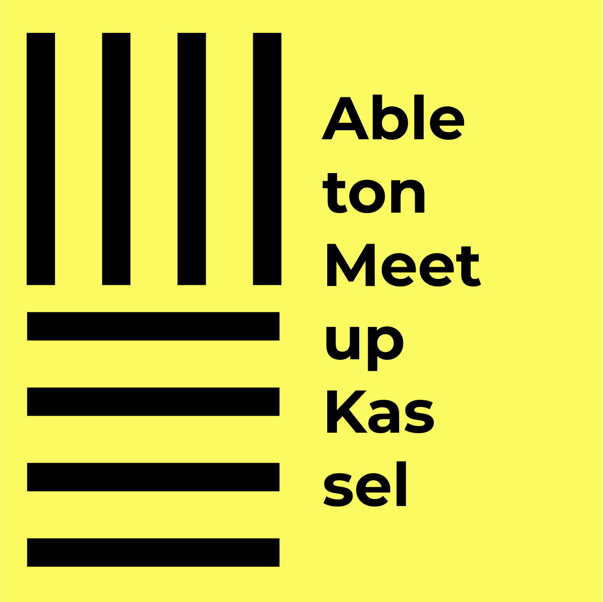

Wir lernen gemeinsam mit der Digital Audio Workstastion (DAW) Ableton Live tolle EDM Tracks zu produzieren.

---

**Termine**
1. [So klappt dein Einstieg - Drum Loop mit Pad und Piano]()
2. [Wie baue ich einen coolen Synth?]()

---

## Was ist EDM? 🎧
EDM steht für *electronic dance music* und ist der Oberbegriff für viele Subgenres der elektronischen Musik, wie zum Beispiel **House, Drum and Base, Trance, Dubstep, oder Techno**.

## Was ist Ableton Live? 🎚️
Ableton Live ist eine **Musik-Software**, mit der du elektronische Musik produzieren kannst. Du kannst dir  [hier](https://www.ableton.com/de/trial/) die kostenlose Testversion herunterladen.

## Anfänger? - Produziere deinen ersten Track 
Komm vorbei, wir zeigen dir die **Grundlagen** und dann kannst du loslegen und selber experimentieren!

## Fortgeschrittener? - Zeig uns deine Skills
Wenn du dich schon gut auskennst, komm gerne vorbei und zeig uns deinen Lieblings-Workflow. Du weißt wie man die besten Synths und Filter einstellt für den besten Sound? Wir freuen uns über dein Wissen.

